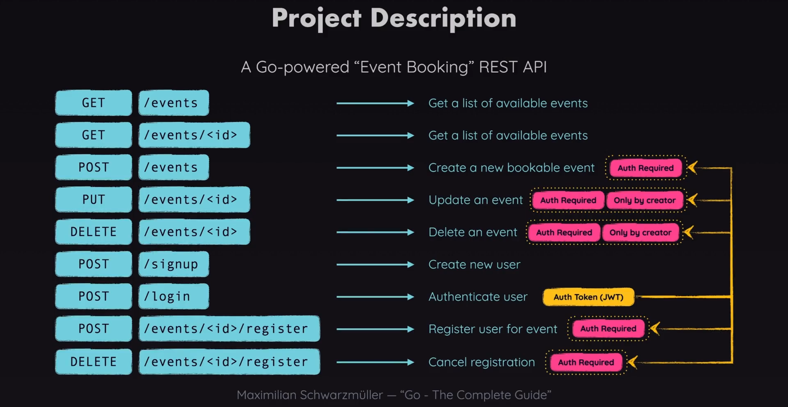

Used Gin web framework: https://github.com/gin-gonic/gin

This library https://github.com/mattn/go-sqlite3 requires CGO_ENABLED=1, which builts the binary using GCC x64 and for GCC you will need https://jmeubank.github.io/tdm-gcc/